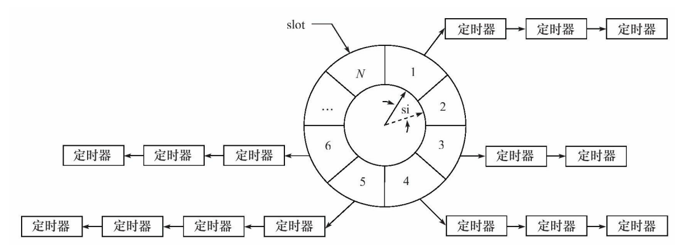

# 十一、定时器

    Linux提供三种定时方法
        - socket选项SO_RCVTIMEO和SO_SNDTIMEO
        - SIGALRM信号
        - I/O复用系统调用的超时参数

## 11.1 socket选项SO_RCVTIMEO和SO_SNDTIMEO
这两个选项仅对与数据接收和发送相关的socket专用系统调用有效


## 11.2 SIGALRM 

由alarm和setitimer函数设置的实时闹钟一旦超时，将触发SIGALRM信号。于是即可处理定时任务。定时精度和定时周期T十分相关。

### 11.2.1 基于升序链表的定时器
详见lst_timer.h

### 11.2.2 处理非活动连接
在应用层实现类似于KEEPALIVE的机制，以管理所有长时间处于非活动状态的连接。
见

## 11.3 IO复用的超时参数

```c
#define TIMEOUT 5000
int timeout=TIMEOUT;
time_t start=time(NULL);
time_t end=time(NULL);
while(1)
{
    printf("the timeout is now%d mil-seconds\n",timeout);
    start=time(NULL);
    int number=epoll_wait(epollfd,events,MAX_EVENT_NUMBER,timeout);
    if((number<0)&&(errno!=EINTR))
    {
        printf("epoll failure\n");
        break;
    }
    /*如果epoll_wait成功返回0，则说明超时时间到，此时便可处理定时任务，并重置定
    时时间*/
    if(number==0)
    {
        timeout=TIMEOUT;
        continue;
    }
    end=time(NULL);
    /*如果epoll_wait的返回值大于0，则本次epoll_wait调用持续的时间是(end-start)*1000 ms，我们需要将定时时间timeout减去这段时间，以获得下次epoll_wait调用的超时参数*/
    timeout-=(end-start)*1000;
    /*重新计算之后的timeout值有可能等于0，说明本次epoll_wait调用返回时，不仅有
    文件描述符就绪，而且其超时时间也刚好到达，此时我们也要处理定时任务，并重置定时时间
    */
    if(timeout<=0)
    {
        timeout=TIMEOUT;
    }
    //handle connections
}
```

## 11.4 高性能定时器

### 11.4.1 时间轮
解决添加定时器效率偏低的问题


    在时间轮内，指针指向轮子的一个槽，每经历一个tick便转动一个槽，这个tick也被称为槽间隔si（slot interval），一个槽是一个链表的头，这条链表上的定时器的定时时间都是N*tick的整数倍。
插入timer时遵循公式：


复杂的时间轮可以包含多个轮子，拥有不同的粒度

```
对时间轮而言，添加一个定时器的时间复杂度是O（1），
删除一个定时器的时间复杂度也是O（1），执行一个定时器的时间复
杂度是O（n）。但实际上执行一个定时器任务的效率要比O（n）好得
多，因为时间轮将所有的定时器散列到了不同的链表上。时间轮的槽越
多，等价于散列表的入口（entry）越多，从而每条链表上的定时器数量
越少。此外，我们的代码仅使用了一个时间轮。当使用多个轮子来实现
时间轮时，执行一个定时器任务的时间复杂度将接近O（1）。
```

### 11.4.2 时间堆
基于最小堆实现，最小堆是指每个节点的值都小于或等于其子节点的值的完全二叉树。
并且可以用数组实现最小堆

时间堆基于这样的思路：将所有定时器中超时时间最小的一个定时器的
超时值作为心搏间隔。这样，一旦心搏函数tick被调用，超时时间最小
的定时器必然到期，我们就可以在tick函数中处理该定时器。然后，再
次从剩余的定时器中找出超时时间最小的一个，并将这段最小时间设置
为下一次心搏间隔。如此反复，就实现了较为精确的定时。

```
对时间堆而言，添加一个定时器的时间复杂度是O（lgn），
删除一个定时器的时间复杂度是O（1），
执行一个定时器的时间复杂度是O（1）。
```


