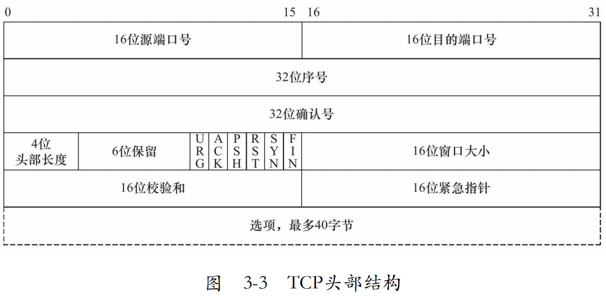
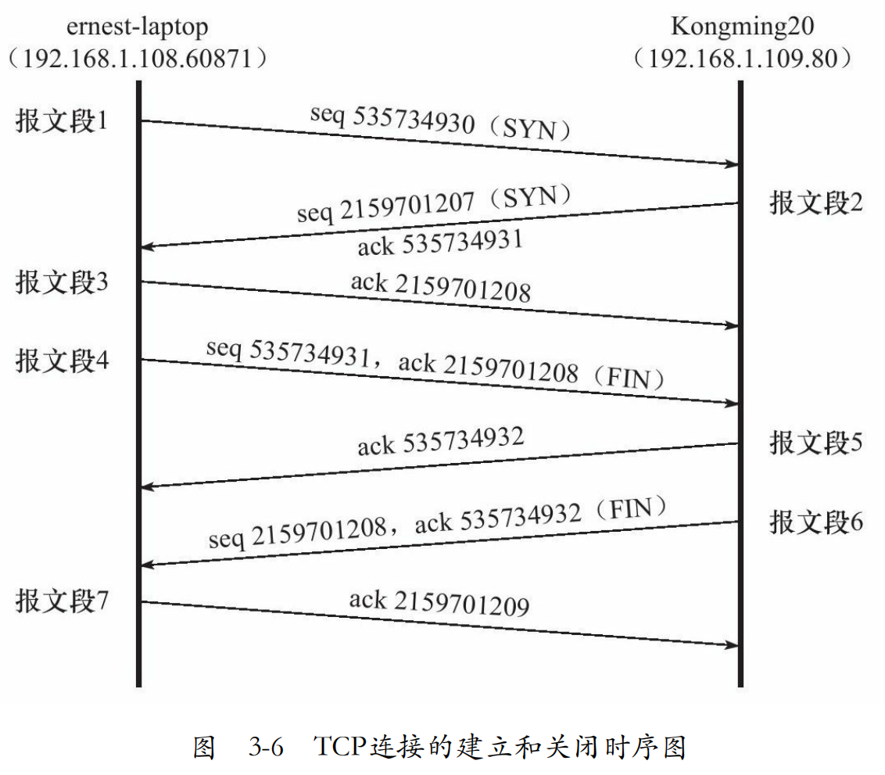
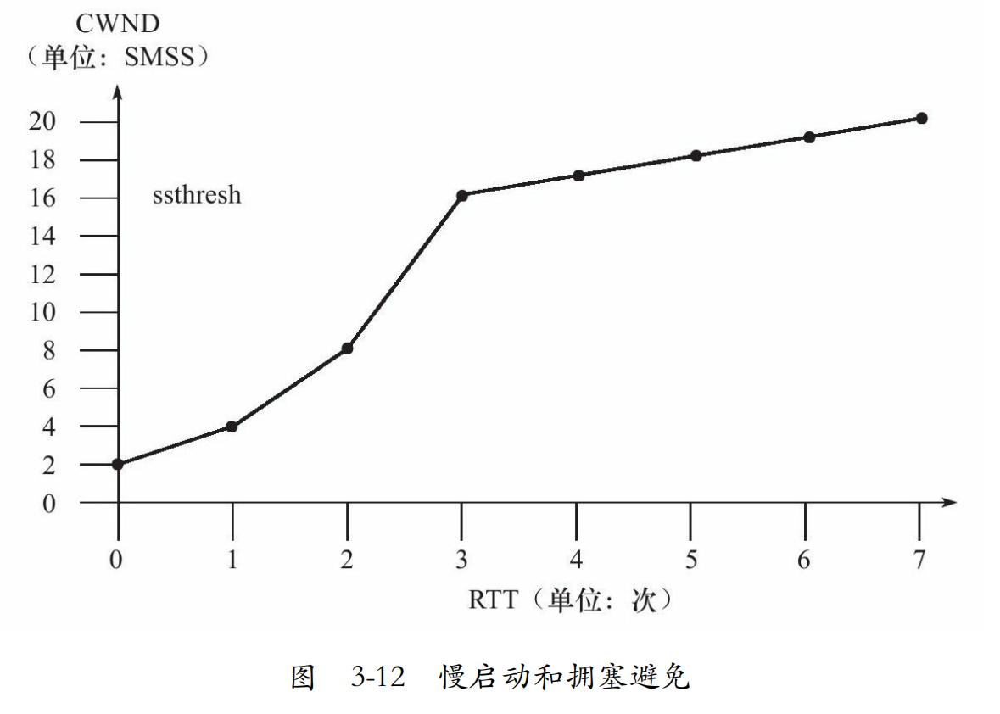

# 三、TCP协议详解

## 3.1 TCP服务的特点
面向连接
字节流
可靠传输

流式传输和报式传输的区别


## 3.2 TCP头部结构


### 头部选项
20字节固定，40字节可变长


## 3.3 TCP连接的建立和关闭

```shell
#建立和关闭的过程
1.IP 192.168.1.108.60871＞192.168.1.109.80:Flags[S],seq
535734930,win 5840,length 0
2.IP 192.168.1.109.80＞192.168.1.108.60871:Flags[S.],seq
2159701207,ack 535734931,win 5792,length 0
3.IP 192.168.1.108.60871＞192.168.1.109.80:Flags[.],ack 1,win
92,length 0
4.IP 192.168.1.108.60871＞192.168.1.109.80:Flags[F.],seq 1,ack
1,win 92,length 0
5.IP 192.168.1.109.80＞192.168.1.108.60871:Flags[.],ack 2,win
91,length 0
6.IP 192.168.1.109.80＞192.168.1.108.60871:Flags[F.],seq 1,ack
2,win 91,length 0
7.IP 192.168.1.108.60871＞192.168.1.109.80:Flags[.],ack 2,win
92,length 0
```



### 半关闭状态

单独一方关闭，但保留接收功能（很少见）


### 连接超时

## 3.4 TCP状态转移


粗虚线表示典型的服务器端连接的状态转移；粗实线表示典型的客户端连接的状态转移。CLOSED是一个假想的起始点，并不是一个实际的状态。


### TIME_WAIT状态

客户端在四次挥手后不马上进入CLOSE状态，而是先进入TIME_WAIT,等待一段长为2MSL（报文段最大生存时间）的时间，才完全关闭。


## 3.5 复位报文段

通知对方关闭连接或重新建立连接。
### 访问不存在的端口
### 异常终止连接
### 处理半打开连接

## 3.6 TCP交互数据流

**实时性  
延时确认  
nagle算法**：确认的越快，发送的越快

## 3.7 TCP成块数据流


为什么发送的大小是16384？
标志P是什么意思？
窗口扩大因子有什么效果？

## 3.8 带外数据

只有最后一字节被当作带外数据

## 3.9 超时重传

## 3.10 拥塞控制

### 概述
**慢启动  
拥塞避免  
快重传  
快恢复**

拥塞控制的最终受控变量是发送端向网络一次连续写入（收到其中第一个数据的确认之前）的数据量，我们称为SWND（Send Window，发送窗口）。


### 慢启动和拥塞避免

慢启动门限  


### 快重传和快恢复


