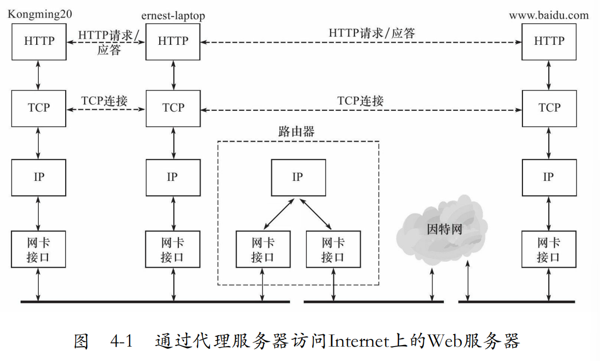
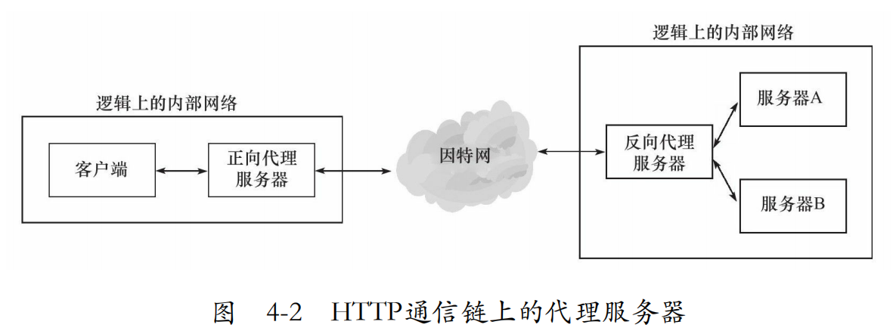

# 四、TCP/IP通信案例：访问Internet上的Web服务器

## 4.1 实例总图


## 4.2 部署代理服务器
**类型**：正向代理，反向代理，透明代理



## 4.3 抓包

## 4.4 访问DNS服务器

```
8.IP 192.168.1.108.46149＞219.239.26.42.53:59410+A?www.baidu.com.(31)
9.IP 219.239.26.42.53＞192.168.1.108.46149:59410 3/4/0 CNAME www.a.shifen.com.,A 119.75.218.77,A 119.75.217.56(162)
```


## 4.5 本地名称查询

## 4.6 HTTP通信

### HTTP请求

``` shell
GET http://www.baidu.com/index.html HTTP/1.0
User-Agent:Wget/1.12(linux-gnu) 
Host:www.baidu.com
Connection:close
```
1.请求行  
2-4.请求头：本地程序，目标主机，连接属性


长连接  
短连接

### HTTP应答

```shell
HTTP/1.0 200 OK
Server:BWS/1.0
Content-Length:8024
Content-Type:text/html;charset=gbk
Set-Cookie:BAIDUID=A5B6C72D68CF639CE8896FD79A03FBD8:FG=1;expires=Wed,04-Jul-42 00:10:47 GMT;path=/;domain=.baidu.com
Via:1.0 localhost(squid/3.0 STABLE18)
```
1.状态行：版本+状态码  
2-7：应答头


