# 八、高性能服务器程序框架

## 8.1 服务器模型

### C/S模型
客户端/服务器模型
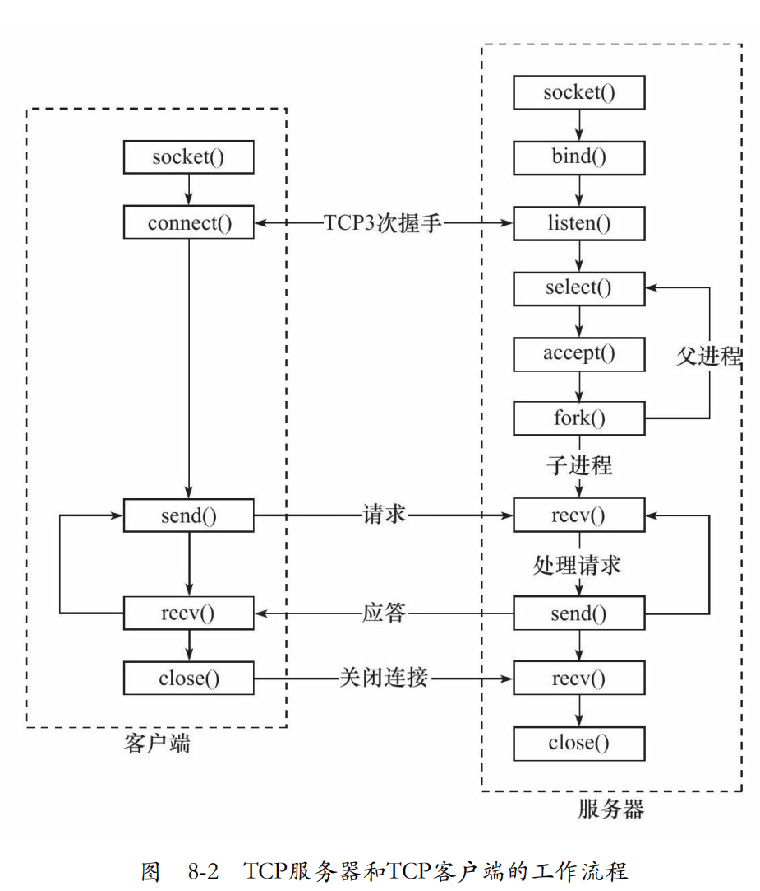

C/S模型非常适合资源相对集中的场合，并且它的实现也很简单
缺点：服务器是通信的中心，当访问量过大时，可能所有客户都将得到很慢的响应。

### P2P模型
点对点模型
相当于每台主机都是客户端和服务器
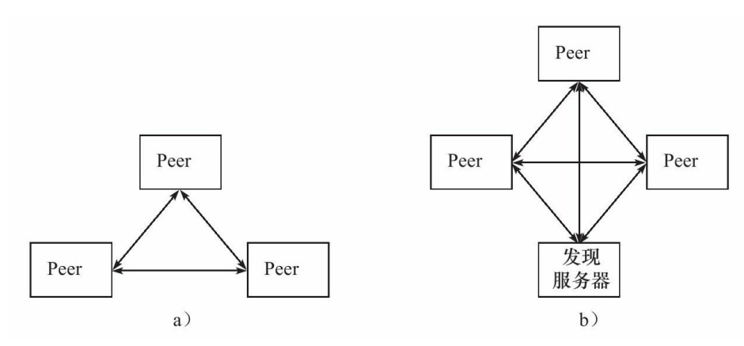

## 8.2 服务器编程框架

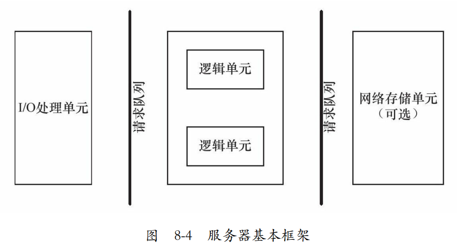

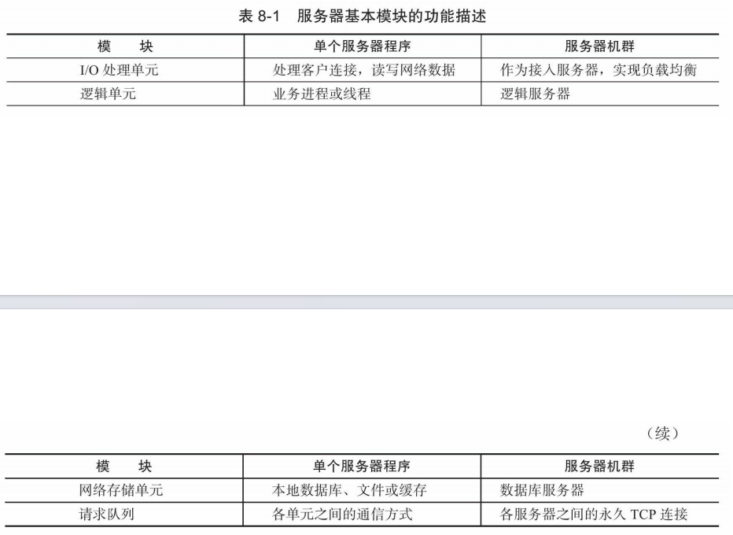

## 8.3 I/O模型

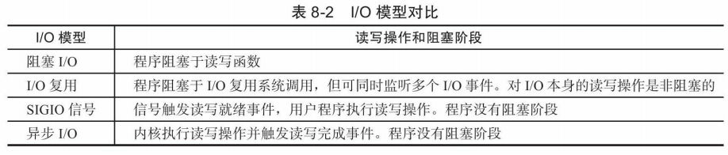

## 8.4 两种高效的事件处理模式
服务器程序通常需要处理三类事件：I/O事件、信号及定时事件。

两种高效的事件处理模式：
### Reactor模式
主线程只负责监听文件描述符上是否有事件发生，若有，则唤醒请求队列上的工作单元处理事件。

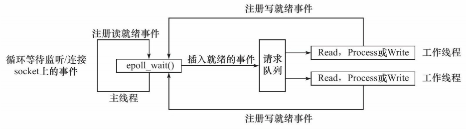

### Proactor模式
Proactor模式将所有I/O操作都交给主线程和内核来处理，工作线程仅仅负责业务逻辑。

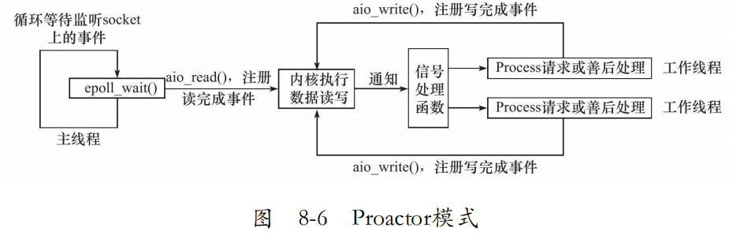

### 模拟Proactor
主线程执行数据读写操作，读写完成之后，主线程向工作线程通知这一“完成事件”。

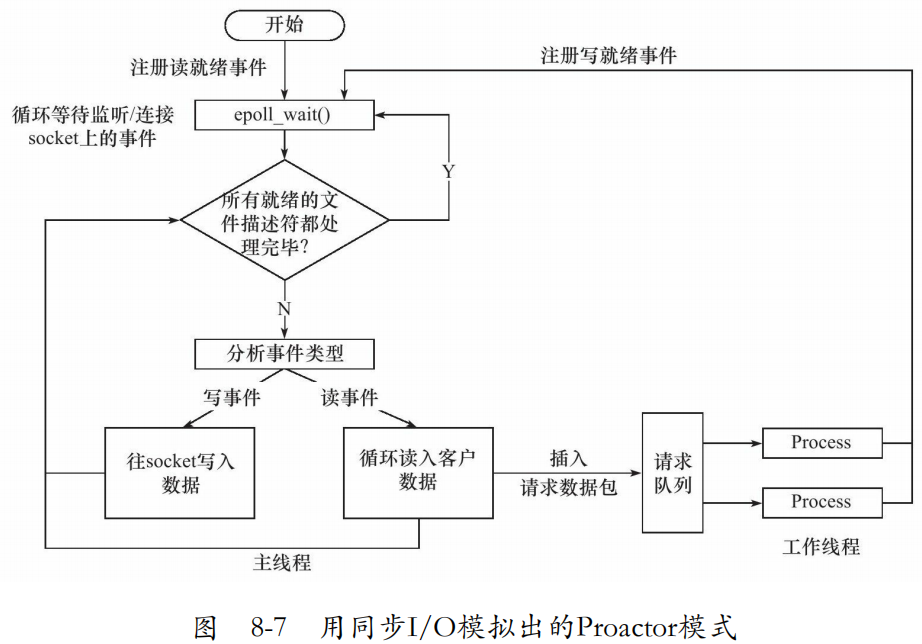

## 8.5 两种高效的并发模式

### 半同步/半异步模式
并发的同步和异步与IO的同步和异步的区别？p286

同步程序和异步程序的好处？p287

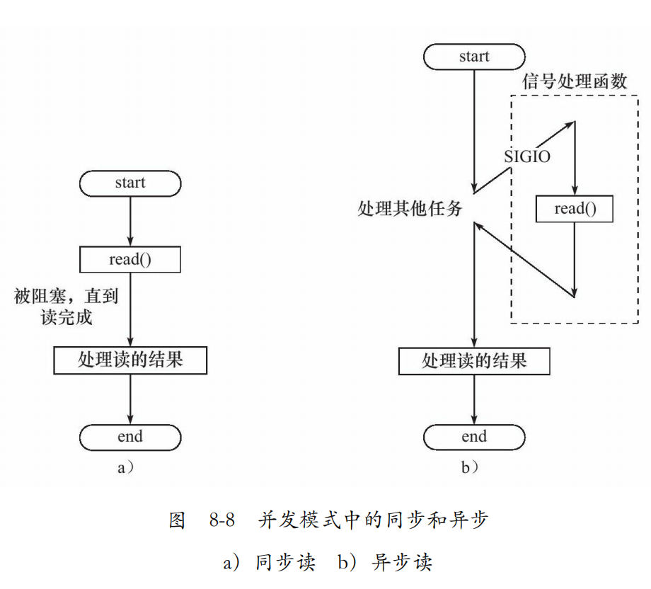

变种之一：
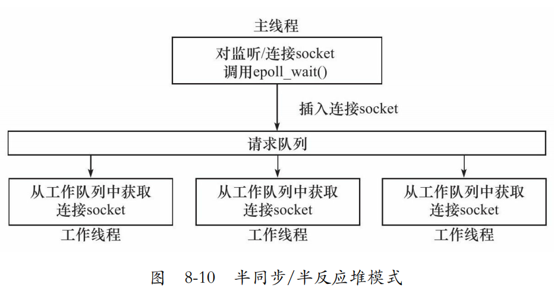
异步线程只有一个，即主线程。

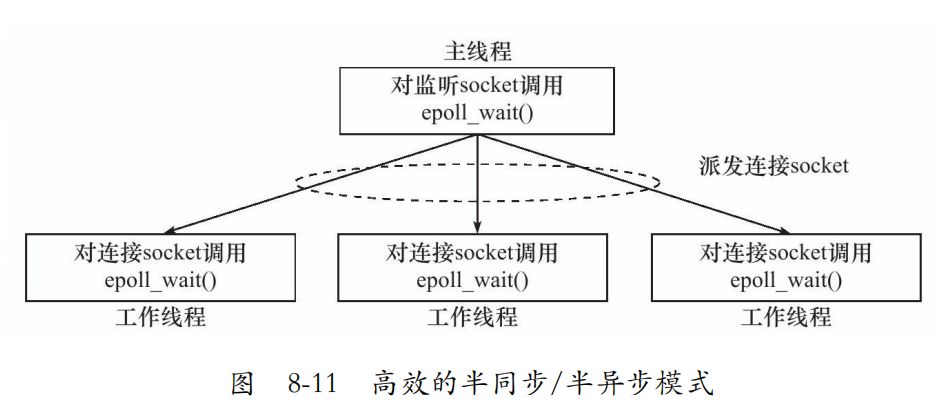
将socket内容直接派发下去给工作线程处理

### 领导者/追随者模式
所需组件：句柄集，线程集，事件处理器，具体的事件处理器

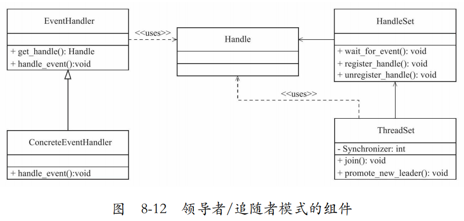
#### 句柄集
句柄（Handle）用于表示I/O资源，在Linux下通常就是一个文件描述符。

#### 线程集
负责各线程之间的同步，以及新领导者线程的推选。

#### 事件处理器和具体的事件处理器

## 8.6 有限状态机
见样例代码3

## 8.7 

### 池
预先分配资源作为池，省去动态分配的时间

### 数据复制
当内容不被关心时多使用零拷贝，减少不必要的数据复制

### 上下文切换和锁
不宜过多的工作进程
尽量少使用锁，或锁的粒度尽可能小

