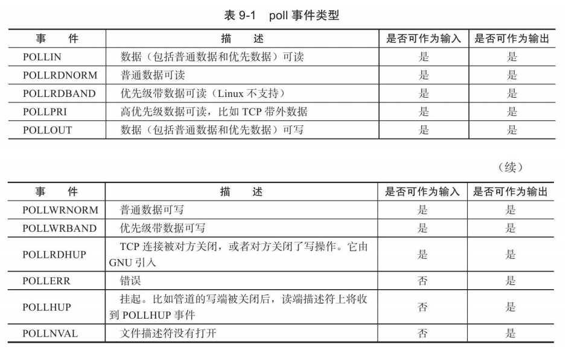

# 九、IO复用

## 9.1 select

```cpp
#include＜sys/select.h＞
int select(int
nfds,fd_set*readfds,fd_set*writefds,fd_set*exceptfds,struct
timeval*timeout);
```


## 9.2 poll

```cpp
#include＜poll.h＞
int poll(struct pollfd*fds,nfds_t nfds,int timeout);


struct pollfd
{
    int fd;/*文件描述符*/
    short events;/*注册的事件*/
    short revents;/*实际发生的事件，由内核填充*/
};
```


## 9.3 epoll

```cpp
#include＜sys/epoll.h＞
int epoll_create(int size)

int epoll_ctl(int epfd,int op,int fd,struct epoll_event*event)

struct epoll_event
{
    __uint32_t events;/*epoll事件*/
    epoll_data_t data;/*用户数据*/
};

typedef union epoll_data
{
    void*ptr;
    int fd;
    uint32_t u32;
    uint64_t u64;
}epoll_data_t;

```

```cpp
int epoll_wait(int epfd,struct epoll_event*events,int
maxevents,int timeout);
```
epoll返回值和select与poll的区别？

### LT和ET模式
LT:高效的poll，可以到下一次wait再响应
ET:高效epoll模式，立即处理ET模式的响应事件

### EPOLLONESHOT
防止被另外的并发线程多次触发

## 9.4 区别


## 9.5 非阻塞connect

## 9.6 聊天室程序


