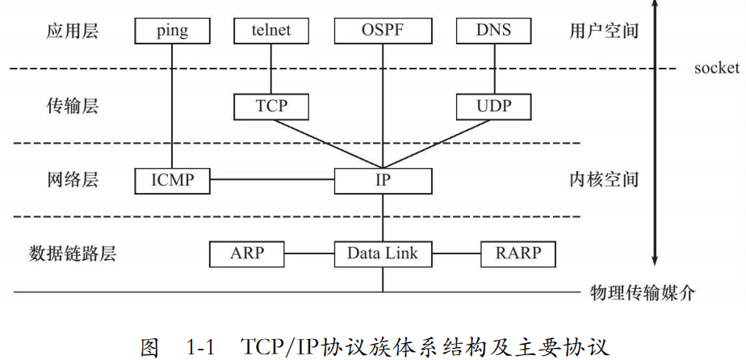
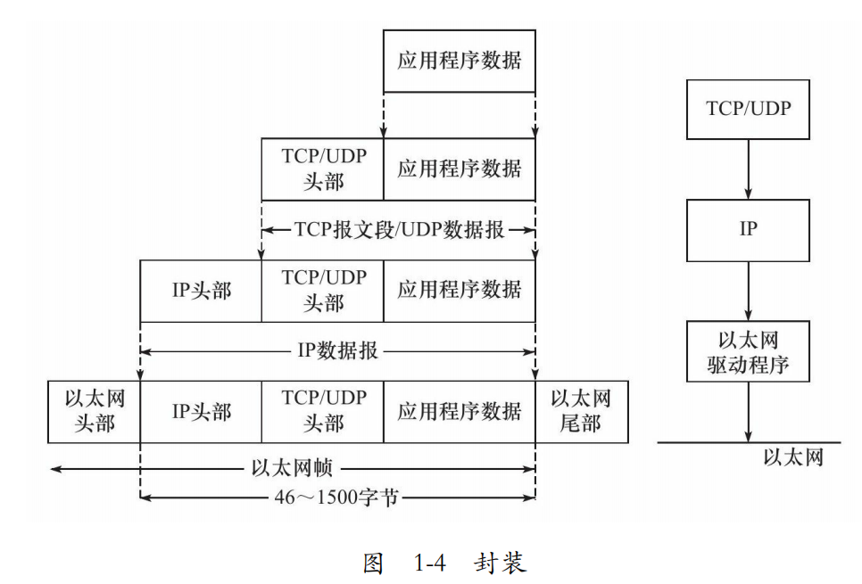
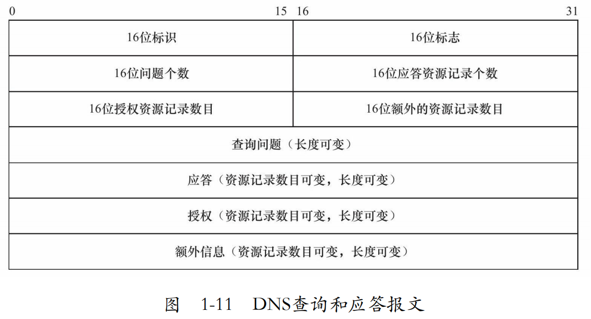

# 一：TCP/IP协议族
# 1.1 TCP/IP体系结构和主要协议
TCP/IP协议族是一个四层协议系统，自底而上分别是**数据链路层、网络层、传输层和应用层**。


**数据链路层**实现了网卡接口的网络驱动程序，以处理数据在物理媒介（比如以太网、令牌环等）上的传输。数据链路层两个常用的协议是ARP协议和RARP协议。

网络层使用IP地址寻址一台机器，而数据链路层使用物理地址寻址一台机器。

**网络层**实现数据包的选路和转发。网络层最核心的协议是IP协议，另外一个重要的协议是ICMP协议。

**传输层**为两台主机上的应用程序提供端到端（end to end）的通信。传输层协议主要有三个：TCP协议、UDP协议和SCTP协议。

**应用层**负责处理应用程序的逻辑。协议众多，例如：telnet协议，OSPF（Open Shortest Path First，开放最短路径优先）协议，DNS（Domain Name Service，域名服务）协议

# 1.2封装
每层协议都将在上层数据的基础上加上自己的头部信息（有时还包括尾部信息），以实现该层的功能，这个过程就称为封装


TCP报文段发送过程：
当发送端应用程序使用send（或者write）函数向一个TCP连接写入数据时，内核中的TCP模块首先把这些数据复制到与该连接对应的TCP内核发送缓冲区中，然后TCP模块调用IP模块提供的服务，传递的参数包括TCP头部信息和TCP发送缓冲区中的数据，即TCP报文段。


# 1.3分用
当帧到达目的主机时，将沿着协议栈自底向上依次传递。各层协议依次处理帧中本层负责的头部数据，以获取所需的信息，并最终将处理后的帧交给目标应用程序。这个过程称为分用（demultiplexing）。

目标主机收到帧后，每一层协议都通过自己的类型字段来区分应该将此帧分配给哪个程序来解析，例如TCP和UDP通过其头部中的16位端口号区分上层应用程序

# 1.4测试网络
作者程序所用的测试网络

# 1.5ARP协议工作原理
ARP协议能实现任意网络层地址到任意物理地址的转换
工作原理是：主机向自己所在的网络**广播**一个ARP请求，该请求包含目标机器的网络地址。此网络上的其他机器都将收到这个请求，但只有被请求的目标机器会回应一个ARP应答，其中包含自己的物理地址。


以太网ARP请求/应答报文解析：
见文章1.5.1

通常，ARP维护一个高速缓存，其中包含经常访问（比如网关地址）或最近访问的机器的IP地址到物理地址的映射。

```shell
arp -a 查看当前arp缓存
arp -d 删除对应arp缓存项
arp -s 添加~
```

# 1.6 DNS协议工作原理
DNS是一套分布式的域名服务系统。每个DNS服务器上都存放着大量的机器名和IP地址的映射，并且是动态更新的。众多网络客户端程序都使用DNS协议来向DNS服务器查询目标主机的IP地址。


DNS查询/应答报文解析：
见文章1.6.1

linux下访问DNS服务器
```
host -t A www.baidu.com
www.baidu.com is an alias for www.a.shifen.com.
www.a.shifen.com has address 183.2.172.42
www.a.shifen.com has address 183.2.172.185

```

# 1.7socket和TCP/IP协议族的关系
socket是一组系统调用，完成对内核中数据链路层、网络层、传输层协议程序的调用
```
由socket定义的这一组API提供如下两点功能：一是将应用程序数据从用户缓冲区中复制到TCP/UDP内核发送缓冲区，以交付内核来发送数据（比如图1-5所示的send函数），或者是从内核TCP/UDP接收缓冲区中复制数据到用户缓冲区，以读取数据；二是应用程序可以通过它们来修改内核中各层协议的某些头部信息或其他数据结构，从而精细地控制底层通信的行为。比如可以通过setsockopt函数来设置IP数据报在网络上
的存活时间。
```
