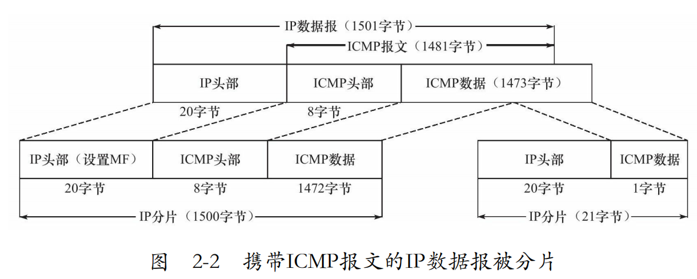
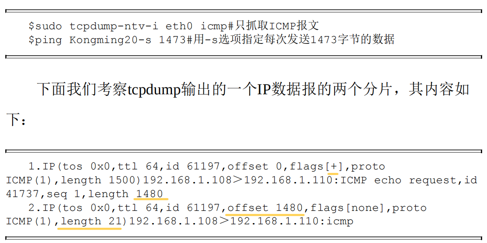
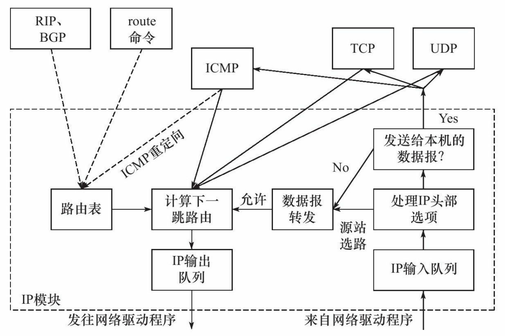
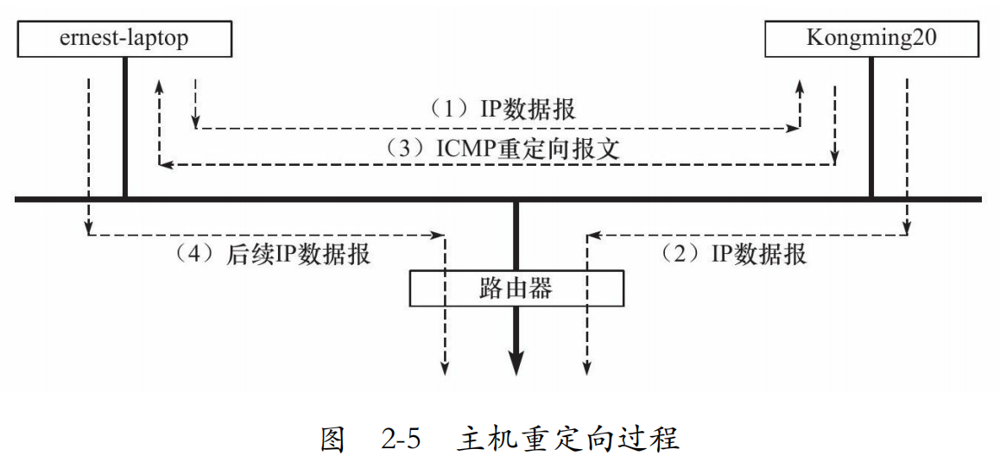

# 二、IP协议详解

## 2.1特点
无状态：所有IP数据报的发送、传输和接收都是相互独立、没有上下文关系的。
无连接：IP通信双方都不长久地维持对方的任何信息。
不可靠：IP协议不能保证IP数据报准确地到达接收端

## 2.2头部结构


## 2.3分片

数据报标识、标志和片偏移给出了分片和重组所需的信息





## 2.4IP路由



### 路由机制
核心：查路由表

### 更新路由表

手动方法
```shell
$ sudo route add-host 192.168.1.109 dev eth0
$ sudo route del-net 192.168.1.0 netmask 255.255.255.0
$ sudo route del default
$ sudo route add default gw 192.168.1.109 dev eth0
```
自动方法  
BGP（Border Gateway Protocol，边际网关协议）、RIP（Routing Information Protocol，路由信息协议）、OSPF等协议

## 2.6ICMP重定向报文
ICMP用途：一般是路由提示IP源地址更好的下一跳,主机接收后会更新路由表缓冲


### 重定向实例

```shell
$ping www.baidu.com
PING www.a.shifen.com(119.75.217.56)56(84)bytes of data.
From Kongming20(192.168.1.109):icmp_seq=1 Redirect Host(New
nexthop:192.168.1.1)
64 bytes from 119.75.217.56:icmp_seq=1 ttl=54 time=6.78 ms
---www.a.shifen.com ping statistics---
1 packets transmitted,1 received,0%packet loss,time 0ms
rtt min/avg/max/mdev=6.789/6.789/6.789/0.000 ms
```



## 2.7IPv6头部结构


### 可拓展头部

